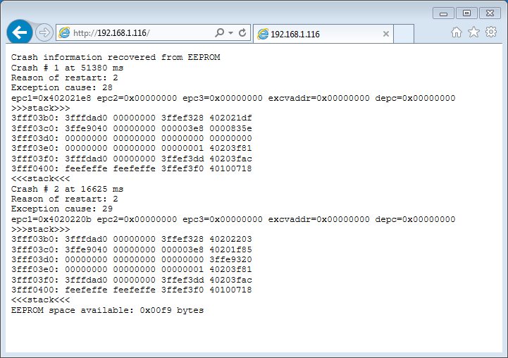
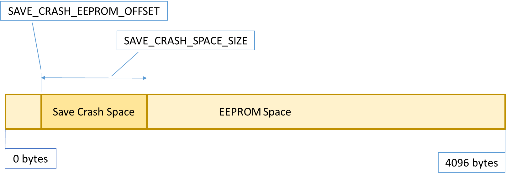

## Examples

The following example Arduino sketches (*.ino) are available with this library:

  1. [SimpleCrash](https://github.com/krzychb/EspSaveCrash/blob/master/examples/SimpleCrash/SimpleCrash.ino) - trigger sample exceptions and show them on a serial monitor.
  2. [ExtendedCrashTester](https://github.com/krzychb/EspSaveCrash/blob/master/examples/ExtendedCrashTester/ExtendedCrashTester.ino) - extended version of SimpleCrash above. It allows triggering additional sample exceptions.
  3. [RemoteCrashCheck](https://github.com/krzychb/EspSaveCrash/blob/master/examples/RemoteCrashCheck/RemoteCrashCheck.ino) - check the list and details of saved exceptions remotely with web browser.
  4. [WebServerCrashCheck](https://github.com/krzychb/EspSaveCrash/blob/master/examples/WebServerCrashCheck/WebServerCrashCheck.ino) - save crash data to user buffer to check it remotely with web browser using ESP8266WebServer. Contributed by [brainelectronics](http://www.brainelectronics.de/).

To use examples below, first you need to [install](readme.md#installation) the [EspSaveCrash](https://github.com/krzychb/EspSaveCrash) library on your PC.


## Table of Contents
- [Simple Crash](#simple-crash)
  - [Set Up](#set-up)
  - [Print Out ](#print-out)
  - [Trigger Exceptions](#trigger-exceptions)
- [Extended Tester](#extended-tester)
- [Remote Crash Check](#remote-crash-check)
- [Library Configuration](#library-configuration)


## Simple Crash

This [sketch](https://github.com/krzychb/EspSaveCrash/blob/master/examples/SimpleCrash/SimpleCrash.ino) demonstrates how to:
* set up the application, so it will automatically capture exceptions and save it in flash memory of ESP module,
* print out saved crash information on a serial monitor,
* trigger sample exceptions to quickly show functionality of this library.

Please refer to section [Quick Start](quick-start.md) for information how to load and use this sketch. Description below will focus on analysis of code functionality.


### Set Up

To make your sketch capturing exceptions include [EspSaveCrash](https://github.com/krzychb/EspSaveCrash) library:

```cpp
#include "EspSaveCrash.h"

EspSaveCrash SaveCrash;
```

That's it.

From now on, if you upload such sketch to the module and the application crashes, crash information will be saved to module's flash memory.


### Print Out

Printing out saved exceptions is done with the following single line of code:

```cpp
SaveCrash.print();
```

**Note:** This line may be included anywhere in the sketch after initializing serial `Serial.begin`.

The following is a sample output of this function.

```
Crash information recovered from EEPROM
Crash # 1 at 65772 ms
Reason of restart: 2
Exception cause: 0
epc1=0x40107001 epc2=0x00000000 epc3=0x00000000 excvaddr=0x00000000 depc=0x00000000
>>>stack>>>
3ffefbf0: 00000000 00000000 3ffeebd0 40201f5c 
3ffefc00: 3fffdad0 00000000 3ffeebec 40202a24 
3ffefc10: feefeffe feefeffe 3ffeec00 40100114 
<<<stack<<<
Crash # 2 at 66594 ms
Reason of restart: 2
Exception cause: 28
epc1=0x40201f87 epc2=0x00000000 epc3=0x00000000 excvaddr=0x00000000 depc=0x00000000
>>>stack>>>
3ffefbf0: 00000000 00000000 3ffeebd0 40201f85 
3ffefc00: 3fffdad0 00000000 3ffeebec 40202a24 
3ffefc10: feefeffe feefeffe 3ffeec00 40100114 
<<<stack<<<
EEPROM space available: 0x0159 bytes

```

Once reserved flash memory is full, at the end of the list, you will see a message as follows:

```
No more EEPROM space available to save crash information!
```

To increase memory space and save move information please refer to chapter [Library Configuration](#library-configuration) below.

If flash memory is empty / there are no any crashes saved, this function will print out:

```
No any crashes saved
```


### Trigger Exceptions

If your sketch is not crashing instantly, it is a good idea to check the library in action in advance. To do so you may use the code snippets inside the `loop()`. 

First the code is checking for any characters typed on the keyboard:

```cpp
void loop(void)
{
  if (Serial.available() > 0)
  {
    char inChar = Serial.read();
    
    // trigger exception
    (...)

  }
}
```

Then, depending on the key pressed, specific exception is triggered. For example, after pressing `0` the following code is executed:

```cpp
  case '0':
    Serial.println("Attempting to divide by zero ...");
    int result, zero;
    zero = 0;
    result = 1 / zero;
    Serial.print("Result = ");
    Serial.println(result);
    break;
```

**Note:** You do not need to include above code in your sketch at all. It is provided only to simulate some exceptions and check how this library works.


## Extended Tester

[ExtendedCrashTester](https://github.com/krzychb/EspSaveCrash/blob/master/examples/ExtendedCrashTester/ExtendedCrashTester.ino) is an extended version of [Simple Crash](#simple-crash) above. It provides the following additional functionality:

  * triggers [write through a pointer to no object](https://en.wikipedia.org/wiki/Null_pointer) exception
  * activates software and hardware WDT - [Watchdog Timer](https://en.wikipedia.org/wiki/Watchdog_timer)
  * allows to reset and restart module from the sketch

It also provides more diagnostic information like printing out time in milliseconds when particular exception was triggered.

**Note:** The hardware WDT is the last resort watchdog triggered by the h/w timer. It is provided in case when the software WDT is not performing. Crash due to h/w WDT cannot be captured by software.


## Remote Crash Check

Your module may be in some remote location where it is inconvenient to use a serial monitor. In such case you can access crash information with a web browser.

This functionality is demonstrated with [RemoteCrashCheck.ino](https://github.com/krzychb/EspSaveCrash/blob/master/examples/RemoteCrashCheck/RemoteCrashCheck.ino) example sketch. 

To make it run update SSID and password to your network and upload it to module. Open serial monitor to check provided IP. 

```
No any crashes saved
Connecting to sensor-net ........ connected
Web server started, open 192.168.1.116 in a web browser

Press a key + <enter>
0 : attempt to divide by zero
e : attempt to read through a pointer to no object
c : clear crash information
```

You may then trigger some exceptions like described in examples discussed above.

Once module connects to the network, after opening provided IP in a web browser, you will be able to see all captured crash information like on the screen below.




## Library Configuration

Crash data is saved using the [EEPROM](https://github.com/esp8266/Arduino/blob/master/doc/libraries.md#eeprom) library that is provided together with [esp8266 / Arduino](https://github.com/esp8266/Arduino) core.

If you like to change flash memory space reserved for storing crash information use class constructor. The maximum value is `4096` (`0x1000`) bytes as defined for the [EEPROM](https://github.com/esp8266/Arduino/blob/master/doc/libraries.md#eeprom) library.

You may have other applications already using EEPROM in which case you must set a third parameter (shown below) in the constructor to set EEPROM to persistent, otherwise the libary will assume EEPROM is not being used by your application and performs EEPROM.end(). Passing an offset parameter to the constructor leaves initial EEPROM space for the other applications. Optionally you can use upper EEPROM space (i.e. above `_offset` + `_size`).

```cpp
//Offset, Size
EspSaveCrash SaveCrash(0x0010, 0x0200);
```

```cpp
//Offset, Size, Persistent EEPROM
EspSaveCrash SaveCrash(0x0010, 0x0200, YOUR_APP_EEPROM_SIZE);
```

Picture below shows relationship between both configuration parameters and total available EEPROM space.



