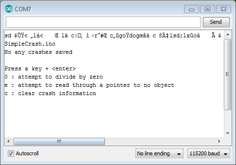
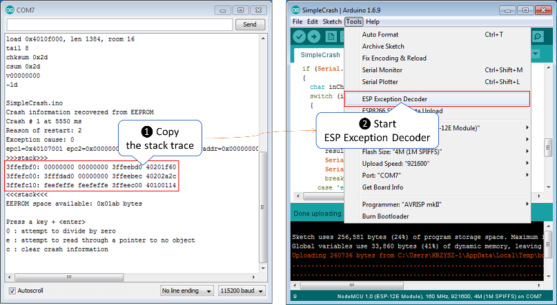
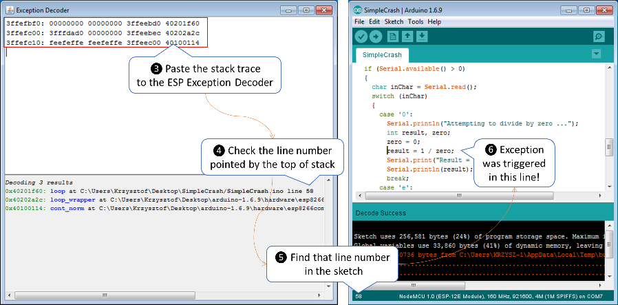

## Quick Start

This section covers basic functionality of [EspSaveCrash](https://github.com/krzychb/EspSaveCrash) library using example sketch [SimpleCrash.ino](https://github.com/krzychb/EspSaveCrash/blob/master/examples/SimpleCrash/SimpleCrash.ino).


## Install Library

To use [EspSaveCrash](https://github.com/krzychb/EspSaveCrash) library in your sketch, you need to install it in your IDE. Please proceed according to description below that covers three popular Arduino IDEs:

* Arduino IDE - use [Library Manager](https://www.arduino.cc/en/Guide/Libraries#toc2) in Arduino IDE and search for *EspSaveCrash*.
* PlatformIO IDE - use PlatformIO's [Library Manager](http://docs.platformio.org/en/stable/librarymanager/). In particular execute `pio lib install 376`.
* Visual Micro - installation procedure is the same as for Arduino IDE above.


## Trigger Execptions

Upload [SimpleCrash.ino](https://github.com/krzychb/EspSaveCrash/blob/master/examples/SimpleCrash/SimpleCrash.ino) to your ESP module and open serial monitor. The following message should be displayed:



Now press `0` + ENTER. This will execute code that attempts to divide by zero. As result module will drop an exception and restart. The following will be displayed:

```
Attempting to divide by zero ...

Exception (0):
epc1=0x40107001 epc2=0x00000000 epc3=0x00000000 excvaddr=0x00000000 depc=0x00000000

(...)

SimpleCrash.ino
Crash information recovered from EEPROM
Crash # 1 at 3792 ms
Reason of restart: 2
Exception cause: 0
epc1=0x40107001 epc2=0x00000000 epc3=0x00000000 excvaddr=0x00000000 depc=0x00000000
>>>stack>>>
3ffefbf0: 00000000 00000000 3ffeebd0 40201f60 
3ffefc00: 3fffdad0 00000000 3ffeebec 40202a2c 
3ffefc10: feefeffe feefeffe 3ffeec00 40100114 
<<<stack<<<
EEPROM space available: 0x01ab bytes
```

To drop another exception press `e` + ENTER. 

Module will restart again. Now you will see two exceptions reported.

```
SimpleCrash.ino
Crash information recovered from EEPROM
Crash # 1 at 3792 ms
Reason of restart: 2
Exception cause: 0
epc1=0x40107001 epc2=0x00000000 epc3=0x00000000 excvaddr=0x00000000 depc=0x00000000
>>>stack>>>
3ffefbf0: 00000000 00000000 3ffeebd0 40201f60 
3ffefc00: 3fffdad0 00000000 3ffeebec 40202a2c 
3ffefc10: feefeffe feefeffe 3ffeec00 40100114 
<<<stack<<<
Crash # 2 at 122449 ms
Reason of restart: 2
Exception cause: 28
epc1=0x40201f8b epc2=0x00000000 epc3=0x00000000 excvaddr=0x00000000 depc=0x00000000
>>>stack>>>
3ffefbf0: 00000000 00000000 3ffeebd0 40201f89 
3ffefc00: 3fffdad0 00000000 3ffeebec 40202a2c 
3ffefc10: feefeffe feefeffe 3ffeec00 40100114 
<<<stack<<<
EEPROM space available: 0x0159 bytes
```

You may trigger more exceptions and should see them displayed in a list as above.

Once reserved flash memory is full, at the end of the list, you will see a message as follows:

```
No more EEPROM space available to save crash information!
```

At this point no more new crash information will be written to the flash. To save new exceptions, you need to clear memory or reserve more memory space. Press `c` + <enter> to clear the memory. You will be now able to capture new exceptions. 

To increase memory space and save move information please refer to [Library Configuration](examples.md#library-configuration).


## Decode Exceptions

Saved exception information provides us with several details **when**, **why** and **where** the code crashed.

* **when** is documented as `Crash # 1 at 65772 ms` that provides crash number and time in milliseconds since module restart when it happened,
* the answer **why** is provided with line `Exception cause: 28` that we can decode using [EXCCAUSE](https://github.com/esp8266/Arduino/blob/master/doc/exception_causes.md#exception-causes-exccause) table.
* the information  **where** is contained in the stack trace:

```
>>>stack>>>
3ffefbf0: 00000000 00000000 3ffeebd0 40201f60 
3ffefc00: 3fffdad0 00000000 3ffeebec 40202a2c 
3ffefc10: feefeffe feefeffe 3ffeec00 40100114 
<<<stack<<<
```

The stack trace starts at the point of crash, and goes step by step backwards, as each program line was executed. 

To decode the stack trace into particular lines of sketch we will use great [Arduino ESP8266/ESP32 Exception Stack Trace Decoder](https://github.com/me-no-dev/EspExceptionDecoder) developed by [@me-no-dev](https://github.com/me-no-dev). It is available for Arduino IDE. Please get it installed following the [instructions](https://github.com/me-no-dev/EspExceptionDecoder#installation). Do not worry - installation is as quick and easy as copying one folder to specific Arduino IDE directory.

Please note you need to use Exception Stack Trace Decoder together with particular sketch that is dropping exception. Compile the sketch in Arduino IDE. The select and copy the stack trace, go to the *Tools* and open the *ESP Exception Decoder*.  



Now paste the stack trace to Exception Decoder's window. At the bottom of this window you should see a list of decoded lines of sketch you have just compiled. On the top of the list, like on the top of the stack trace, there is a reference to the line that fired the exception. Check the number of this line and look it up on the sketch. 



In this particular case we have used the stack trace dropped when attempting to divide by zero. Therefore Exception Decoder pointed to the line 58 that contains `result = 1 / zero`.

> Note: To decode the exact line of code where the application crashed, you need to use ESP Exception Decoder in context of sketch you have just compiled. Decoder is not able to correctly decode the stack trace dropped by some other application not compiled in your Arduino IDE.

To learn more in how to interpret exception information and how to troubleshoot ESP8266 crashes, please check FAQ item [My ESP crashes running some code. How to troubleshoot it?](https://github.com/esp8266/Arduino/tree/master/doc/faq#my-esp-crashes-running-some-code-how-to-troubleshoot-it) in documentation section of [esp8266 / Arduino](https://github.com/esp8266/Arduino) repository.